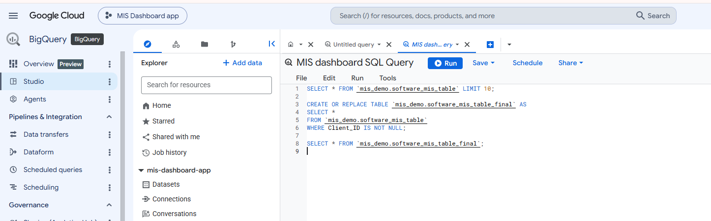
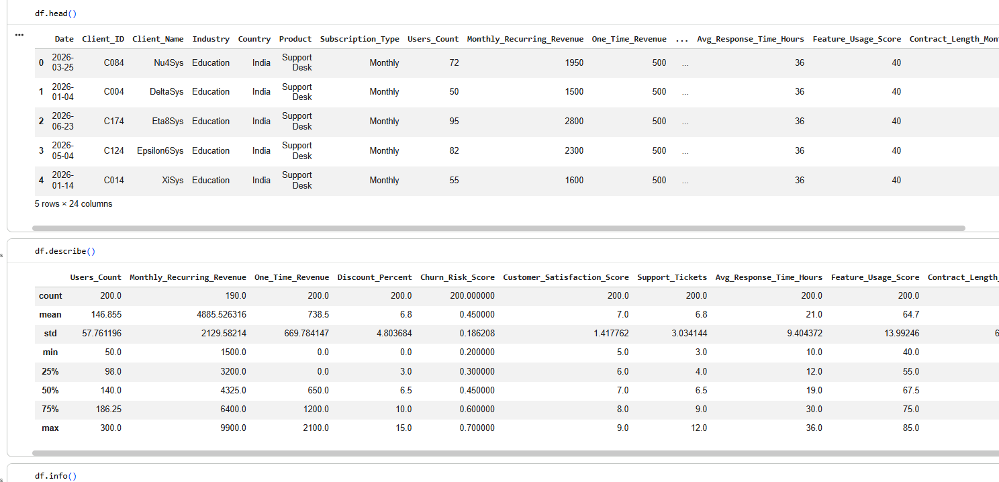
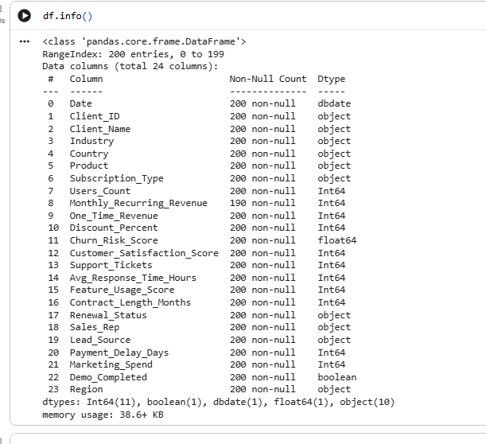
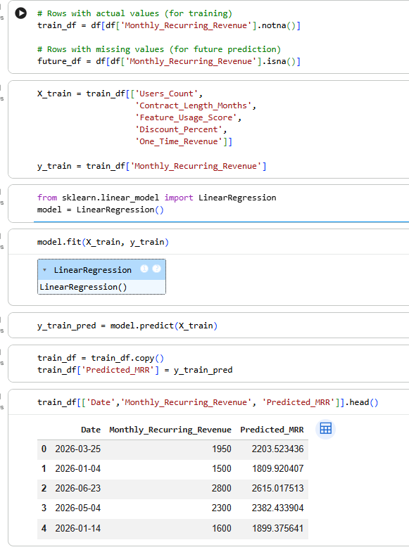
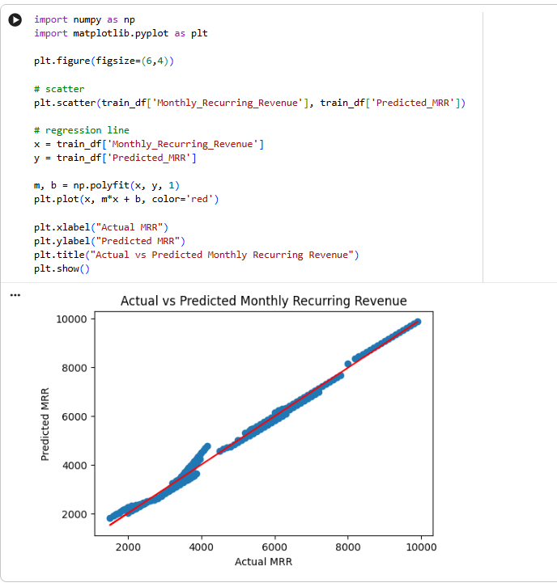
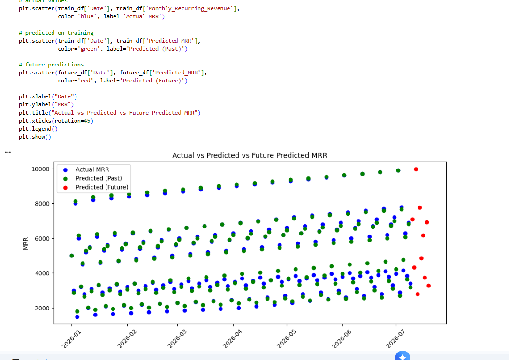
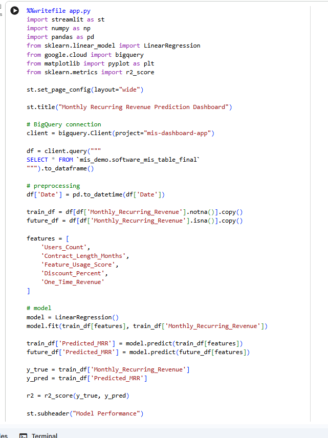
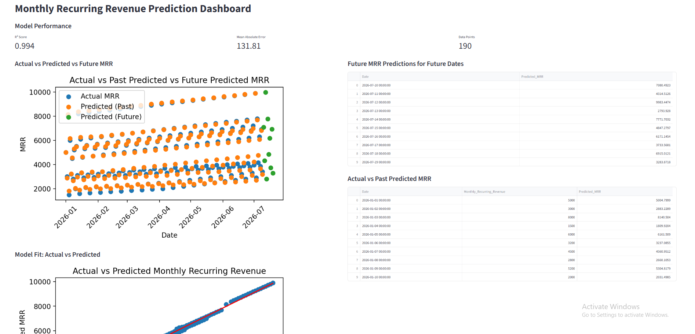

# Monthly Recurring Revenue (MRR) Prediction Dashboard

## 📖 Project Overview
This project builds an end-to-end machine learning pipeline to predict Monthly Recurring Revenue (MRR) using historical business data.  
It also includes an interactive Streamlit dashboard to visualize past performance and future predictions.

The goal is to simulate a real-world data workflow:
- Data stored in BigQuery
- Data cleaned using SQL
- Model trained using Python
- Results visualized in a dashboard

---

## 🧱 Dataset Description

The dataset contains key SaaS business metrics:

- Client_ID → Unique customer identifier  
- Date → Record date  
- Users_Count → Number of users per client  
- Contract_Length_Months → Subscription duration  
- Feature_Usage_Score → Product usage intensity  
- Discount_Percent → Discount offered  
- One_Time_Revenue → One-time payments  
- Monthly_Recurring_Revenue → Target variable (MRR)  

---

## 📊 Step 1: Data Upload & Cleaning (BigQuery)

The dataset was uploaded into Google BigQuery and cleaned using SQL queries.

- Removed invalid/null records  
- Standardized schema  
- Created final table for analysis  

---

## 📊 Step 2: Data Analysis

Initial data exploration was done using Pandas:

- head() → preview data  
- describe() → statistical summary  
- info() → data types & null values  

---

## 📊 Step 3: Missing Values Detection

Rows with missing MRR were identified.  
These rows are important because they will be used for **future prediction**.

---

## 📊 Step 4: Data Splitting

The dataset was split into:

- Training Data → rows where MRR is available  
- Future Data → rows where MRR is missing  

This allows the model to learn from past data and predict future revenue.

---

## 🤖 Step 5: Model Training

A Linear Regression model was used.

### Features:
- Users_Count  
- Contract_Length_Months  
- Feature_Usage_Score  
- Discount_Percent  
- One_Time_Revenue  

### Target:
- Monthly_Recurring_Revenue  

The model learns the relationship between customer behavior and revenue.

---

## 📈 Step 6: Model Fit (Actual vs Predicted)

This visualization compares actual vs predicted MRR values.

- Helps evaluate model accuracy  
- Ideally points should align along a straight line  

---

## 📈 Step 7: Time-Based Predictions

This chart shows:

- Actual MRR (past)  
- Predicted MRR (past)  
- Predicted MRR (future)  

This helps understand revenue trends and forecast future performance.

---

## 💻 Step 8: Streamlit Dashboard

An interactive dashboard was built using Streamlit.

Features:
- KPI cards (R² Score, MAE, Data Points)  
- Charts for prediction analysis  
- Tables for quick data view  

---

## 📊 Final Dashboard Output

The final dashboard combines all insights into one view for easy decision-making.

---

## ⚙️ How to Run the Project

1. Install dependencies  
2. Run the Streamlit app  

Command:
streamlit run app.py  

---

## 🛠 Tech Stack

- Python  
- Pandas  
- NumPy  
- Scikit-learn  
- Matplotlib  
- Google BigQuery  
- Streamlit  

---

## ✅ Outcome

- Built an end-to-end ML pipeline  
- Predicted missing revenue values  
- Created an interactive dashboard  
- Generated actionable business insights  

---

## 🚀 Future Improvements

- Use advanced models (XGBoost, Random Forest)  
- Add filters (date, customer segmentation)  
- Deploy dashboard to cloud  
- Enable real-time data updates  
